# Aito Grocery Store Demo

> ### 🚀 **[Try the Live Demo → demo.aito.ai](https://demo.aito.ai/)**
> Experience AI-powered grocery shopping with personalized recommendations, smart search, and predictive cart filling!

Aito.ai is a predictive database, that provides real time predictions, recommendations and statistics via instant SQL-like queries without separate train step. The goal of the system is to drastically reduce the effort needed to create basic machine learning applications.

The Aito.ai demo highlights 13 production-ready ML features that can be build extremely quickly using the predictive database capabilities. Each live feature comes with screenshots, code samples and tutorials. 

[](https://demo.aito.ai/) [](LICENSE.txt) [](https://aito.ai)

## Try It Now

```bash
# Test the API instantly (no signup required)
curl -X POST https://shared.aito.ai/db/aito-demo/api/v1/_predict \
  -H "X-API-Key: bvss2i2dIkaWUfBCdzEO89LpPNhqjD" \
  -H "Content-Type: application/json" \
  -d '{
    "from": "products",
    "where": {"name": {"$match": "milk"}},
    "predict": "tags"
  }'
```

## What I Built

### 1. 🎯 Dynamic Recommendations
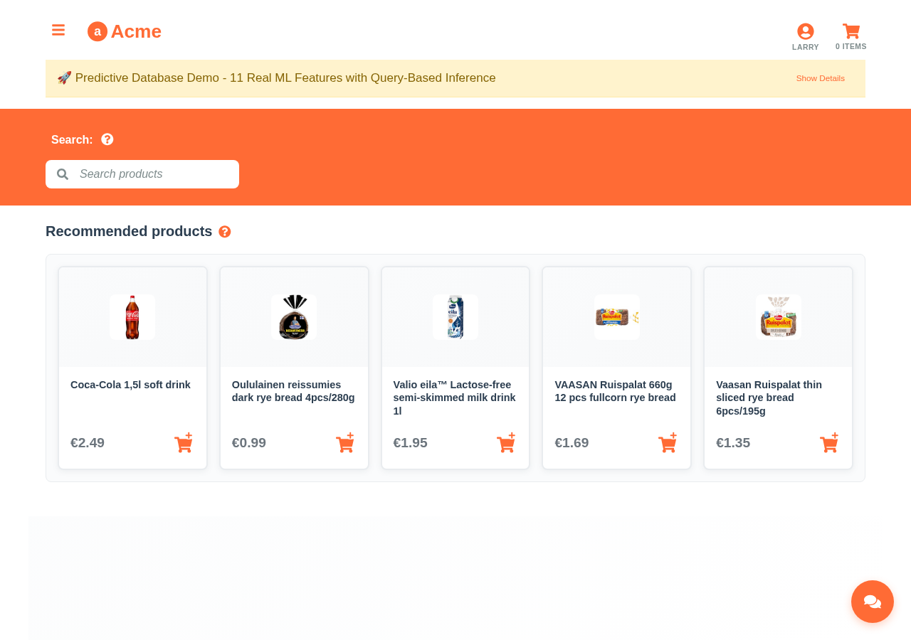
```json
{
  "from": "impressions",
  "where": {
    "context.user": "larry",
    "product.id": { "$and": [{ "$not": "10" }, { "$not": "15" }] }
  },
  "recommend": "product",
  "goal": { "purchase": true },
  "select": ["name", "id", "tags", "price"],
  "limit": 5
}
```
[→ Implementation](src/01-recommend.js) | [Use case guide](docs/use-cases/01-recommendations.md) | [🚀 Live Demo](https://demo.aito.ai/)

### 2. 💡 Intelligent Autocomplete
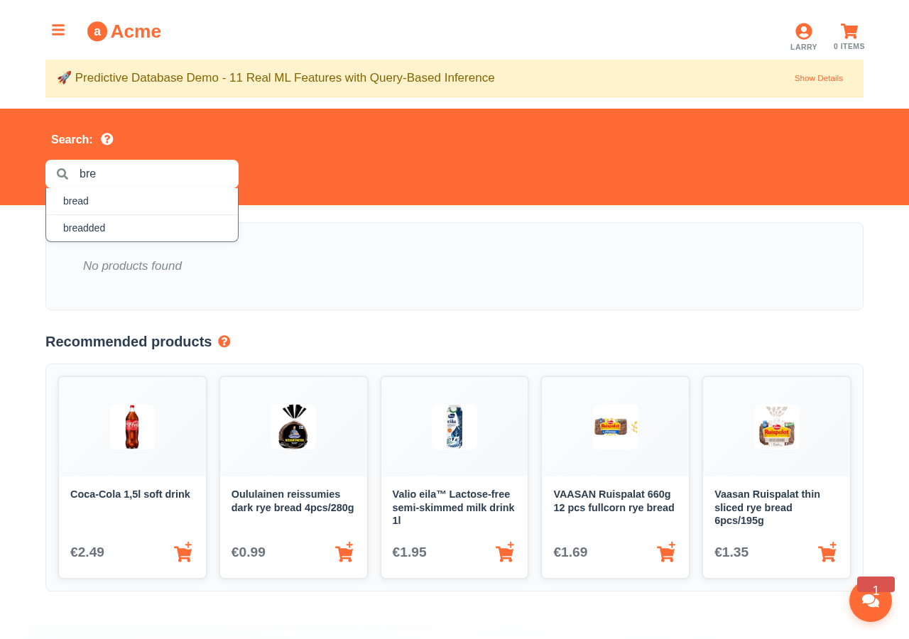
```json
{
  "from": "contexts",
  "where": { 
    "queryPhrase": { "$startsWith": "mil" },
    "user": "larry" 
  },
  "get": "queryPhrase",
  "orderBy": "$p",
  "select": ["$p", "$value"]
}
```
[→ Implementation](src/02-autocomplete.js) | [Use case guide](docs/use-cases/02-autocomplete.md) | [🚀 Live Demo](https://demo.aito.ai/)

### 3. 🔍 Smart Search with Personalization
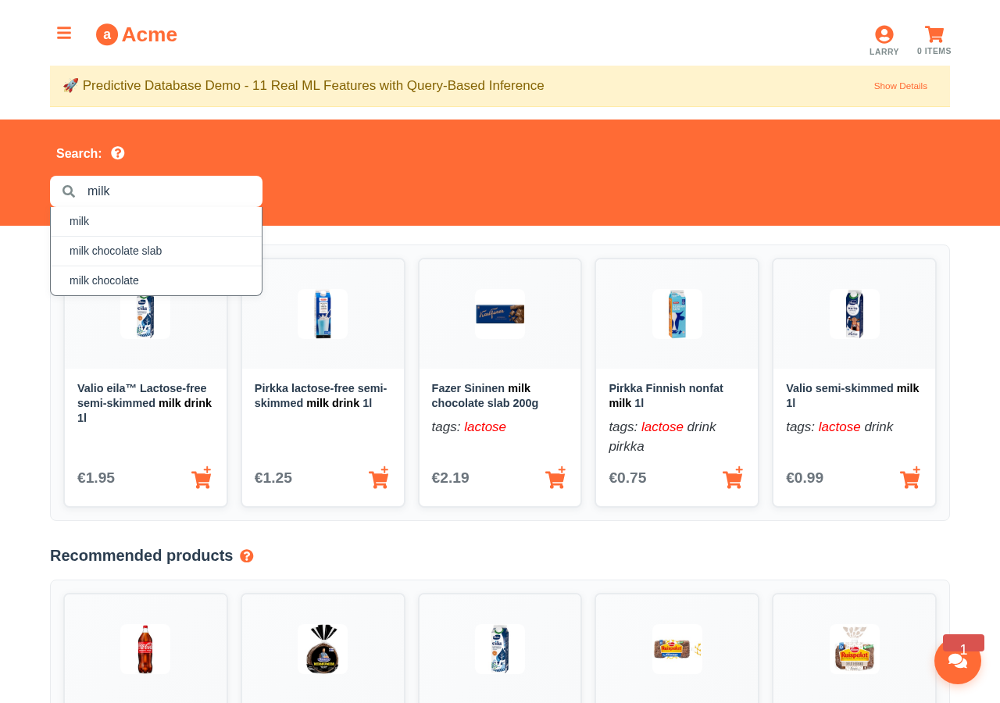
```json
{
  "from": "impressions",
  "where": {
    "product": {
      "$or": [
        { "tags": { "$match": "milk" } },
        { "name": { "$match": "milk" } }
      ]
    },
    "context.user": "larry"
  },
  "get": "product",
  "orderBy": {
    "$multiply": [
      "$similarity",
      { "$p": { "$context": { "purchase": true } } }
    ]
  },
  "select": ["name", "id", "tags", "price", "$matches"],
  "limit": 5
}
```
[→ Implementation](src/03-search.js) | [Use case guide](docs/use-cases/03-smart-search.md) | [🚀 Live Demo](https://demo.aito.ai/)

### 4. 🏷️ Automated Tag Prediction
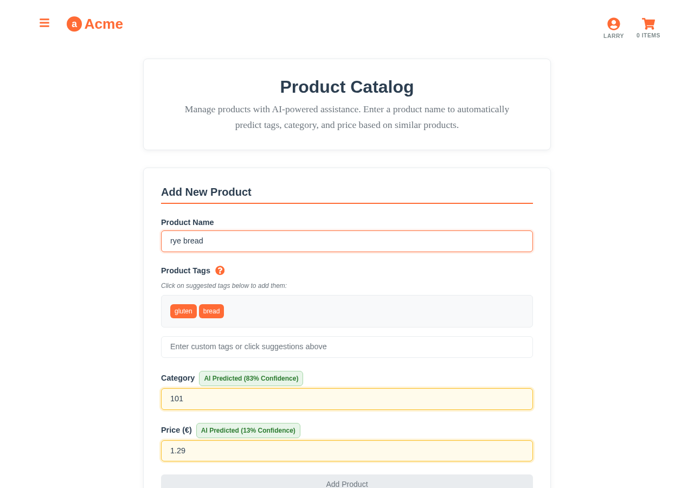
```json
{
  "from": "products",
  "where": { "name": "Rye bread" },
  "predict": "tags",
  "exclusiveness": false,
  "limit": 10
}
```
// Filter: hit.$p > 0.5, Extract: hit.feature
// Returns: ['organic', 'chocolate', 'dark', 'healthy', 'premium']
[→ Implementation](src/04-get-tag-suggestions.js) | [Use case guide](docs/use-cases/04-tag-prediction.md) | [🚀 Live Demo](https://demo.aito.ai/admin)

### 5. 📝 Smart Cart Autofill
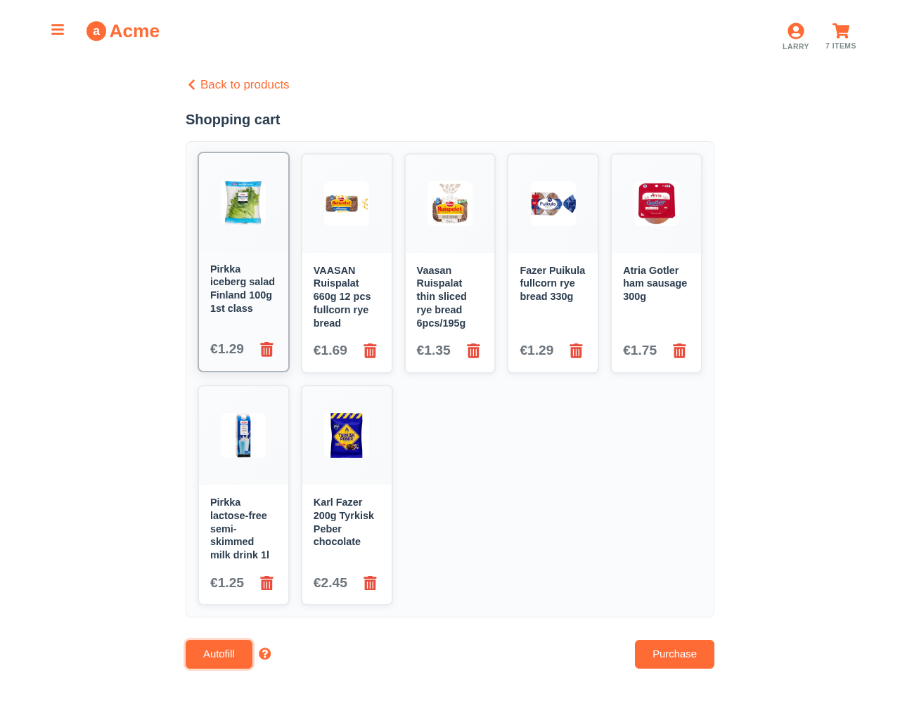
```json
{
  "from": "visits",
  "where": { "user": "larry" },
  "predict": "purchases",
  "exclusiveness": false,
  "select": ["$p", "$value"]
}
```
// Filter results: hit.$p >= 0.4 (40%+ confidence)
[→ Implementation](src/05-autofill.js) | [Use case guide](docs/use-cases/05-autofill.md) | [🚀 Live Demo](https://demo.aito.ai/cart)

### 6. 🗣️ NLP Text Classification
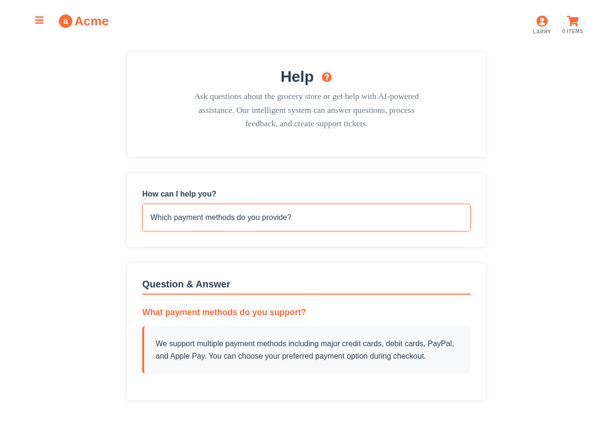
```json
{
  "from": "prompts",
  "where": { "prompt": "Which payment methods do you provide?" },
  "predict": "answer"
}
```
// Returns: sentiment: 'negative', category: 'user_experience'
[→ Implementation](src/06-prompt.js) | [Use case guide](docs/use-cases/06-nlp-processing.md) | [🚀 Live Demo](https://demo.aito.ai/help)

### 7. 📊 Statistical Relationship Discovery
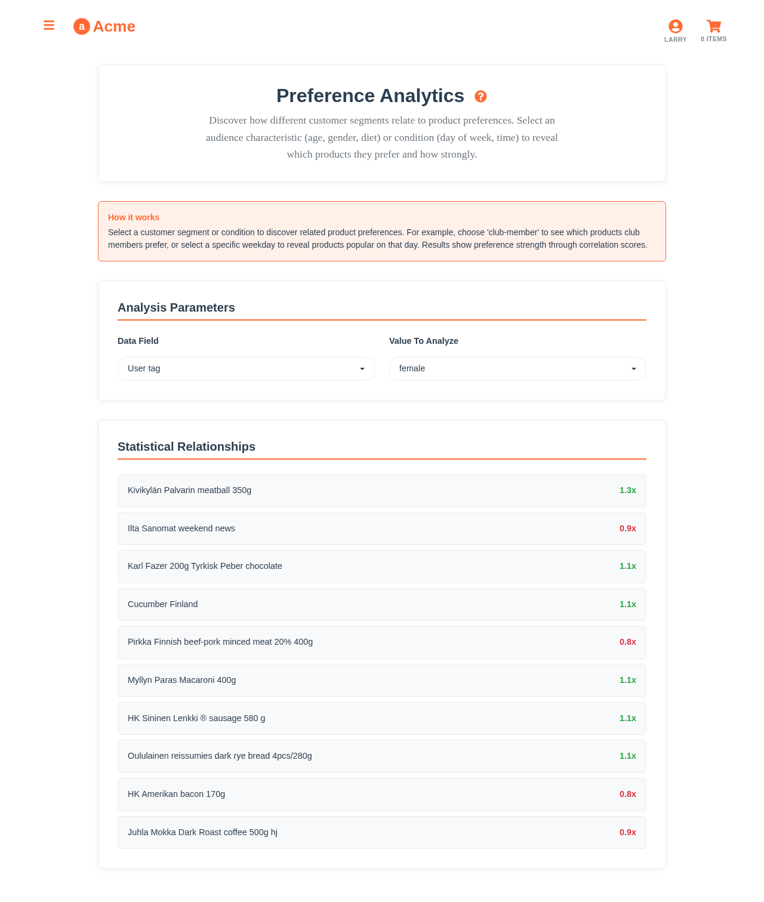
```json
{
  "from": "visits",
  "where": { "user.tags": "club-member" },
  "relate": "purchases"
}
```
// Returns: lift scores showing what club members buy more
[→ Implementation](src/07-relate.js) | [Use case guide](docs/use-cases/07-data-analytics.md) | [🚀 Live Demo](https://demo.aito.ai/analytics)

### 8. 📄 Automated Invoice Processing
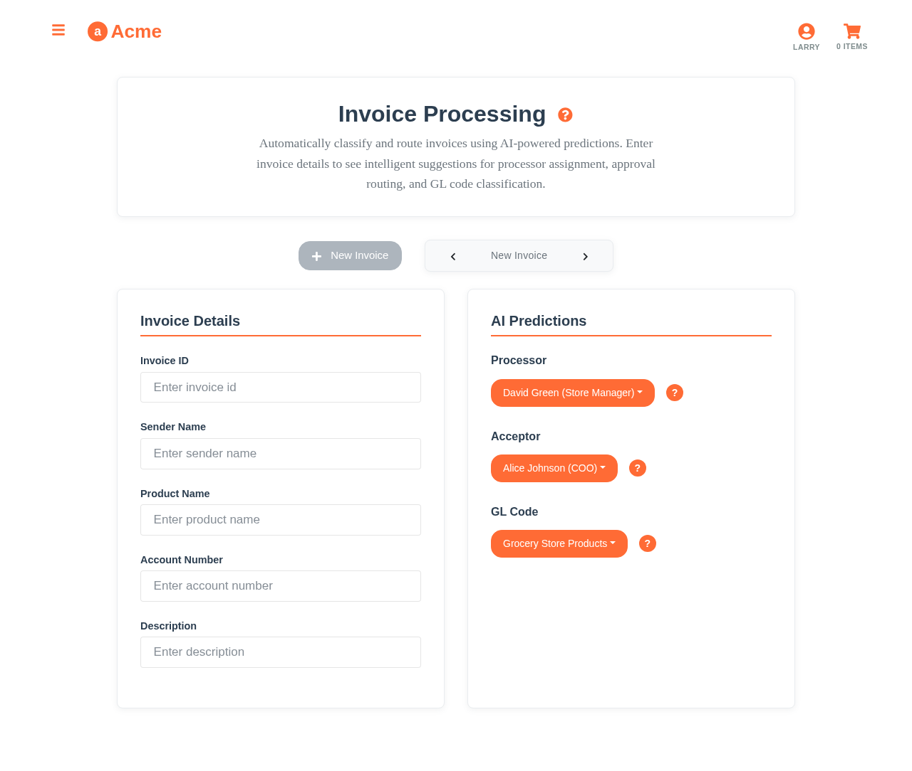
```json
{
  "from": "invoices",
  "where": { "Description": "AWS Cloud" },
  "predict": "Processor",
  "select": ["$p", "Name", "Role", { "$why": { "highlight": true } }]
}
```
[→ Implementation](src/08-predict-invoice.js) | [Use case guide](docs/use-cases/08-invoice-processing.md) | [🚀 Live Demo](https://demo.aito.ai/invoicing)

### 9. 📈 Product Analytics Dashboard
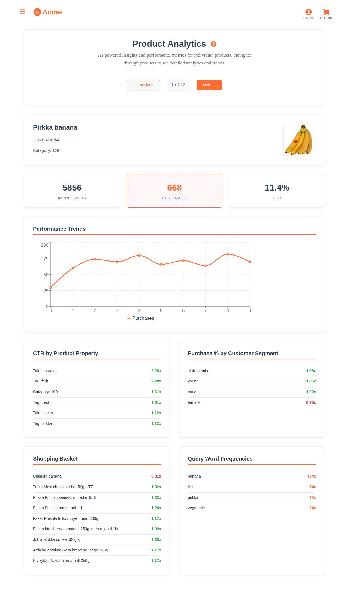
```json
[
  {
    "from": "impressions",
    "where": { "purchase": true },
    "relate": { "product": "42" },
    "select": ["lift", "related"]
  },
  {
    "from": "visits",
    "where": { "purchases": { "$has": "42" } },
    "relate": "user.tags",
    "select": ["lift", "related"]
  }
]
```
[→ Implementation](src/09-product.js) | [Use case guide](docs/use-cases/09-product-analytics.md) | [🚀 Live Demo](https://demo.aito.ai/product)

### 10. 🤖 AI Shopping Assistant
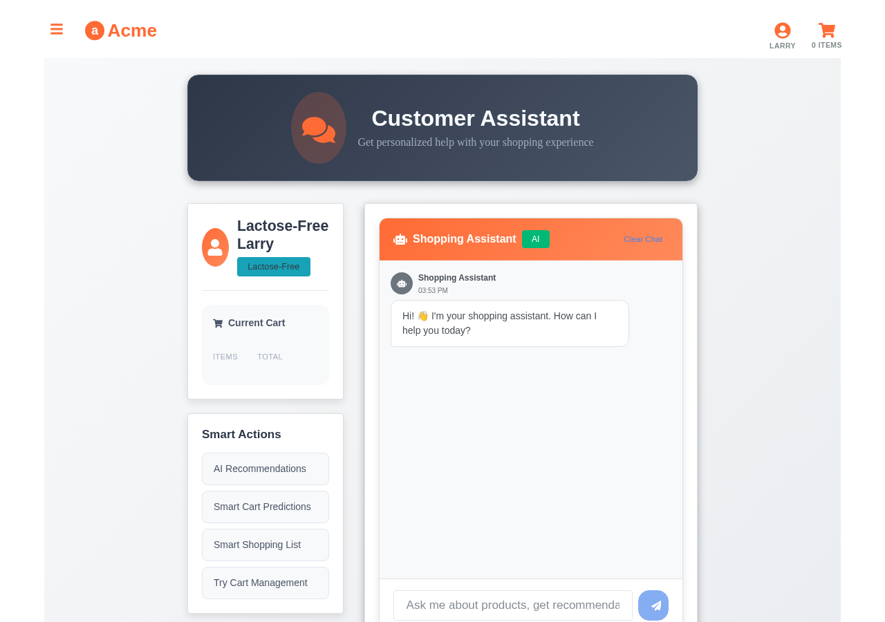
```json
{
  "from": "impressions",
  "where": {
    "product.tags": { "$match": "gluten-free bread" },
    "product.price": { "$lte": 5 }
  },
  "orderBy": { "$p": { "$context": { "purchase": true } } }
}
```
// "Find gluten-free bread under $5"
[→ Implementation](src/services/chatTools/customerTools.js) | [Use case guide](docs/tutorials/assistant-integration.md) | [🚀 Live Demo](https://demo.aito.ai/customer-chat)

### 11. 🔧 Admin Business Intelligence
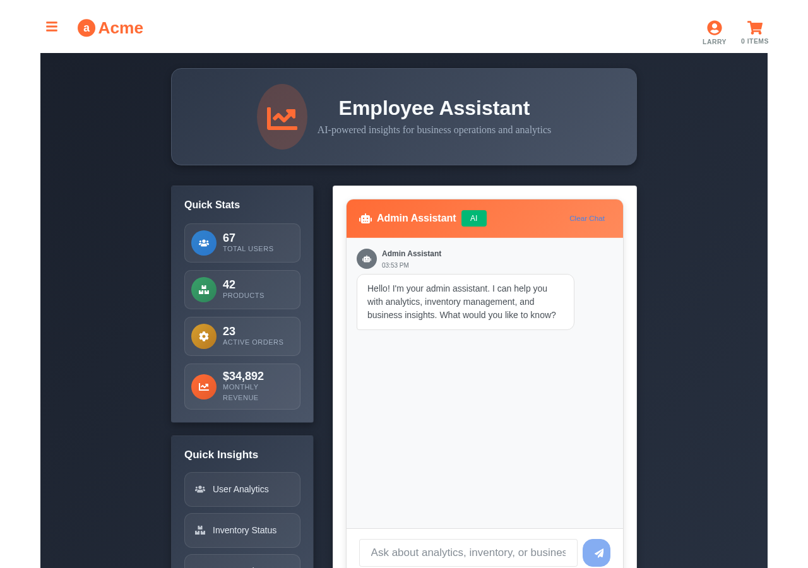
```json
{
  "from": "impressions",
  "where": { "purchase": true, "context.week": "2024-03" },
  "get": { "$group": "product.name", "$stats": { "sales": { "$count": true } } },
  "orderBy": { "sales": -1 }
}
```
// "What are our top selling products this week?"
[→ Implementation](src/services/chatTools/adminTools.js) | [Use case guide](docs/tutorials/assistant-integration.md) | [🚀 Live Demo](https://demo.aito.ai/admin-chat)

### 12. 📊 Quality Monitoring & Model Evaluation
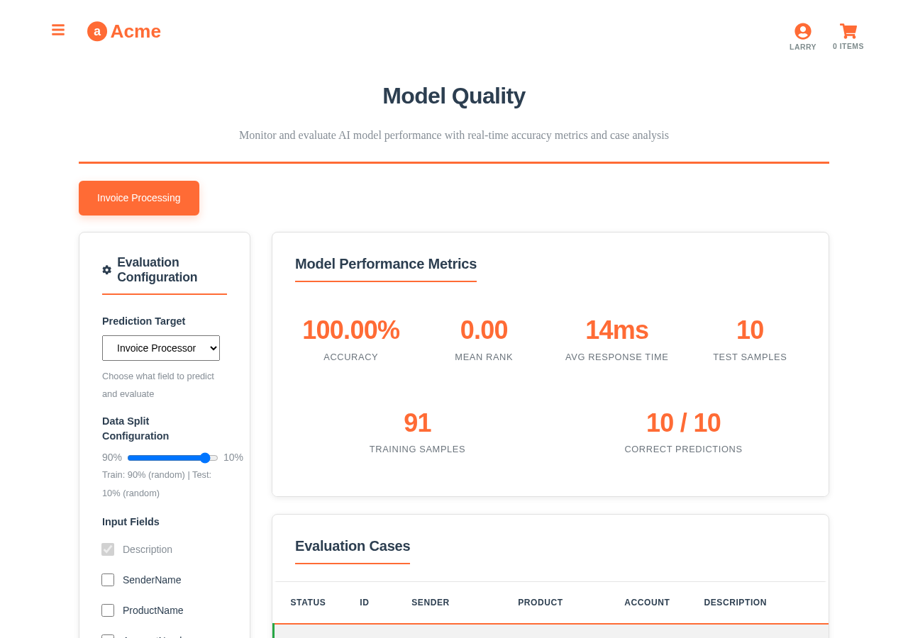
```json
{
  "test": { "$index": { "$gt": 90 } },
  "evaluate": {
    "from": "impressions",
    "where": { "context.user": { "$exists": true } },
    "predict": "purchase"
  },
  "select": ["accuracy", "meanRank", "meanMs", "cases"]
}
```
// Returns: accuracy: 0.87, meanRank: 2.3, meanMs: 45
[→ Implementation](src/11-evaluate.js) | [Use case guide](docs/use-cases/10-quality-monitoring.md) | [🚀 Live Demo](https://demo.aito.ai/quality)

### 13. 💰 Price Optimization & Demand Forecasting
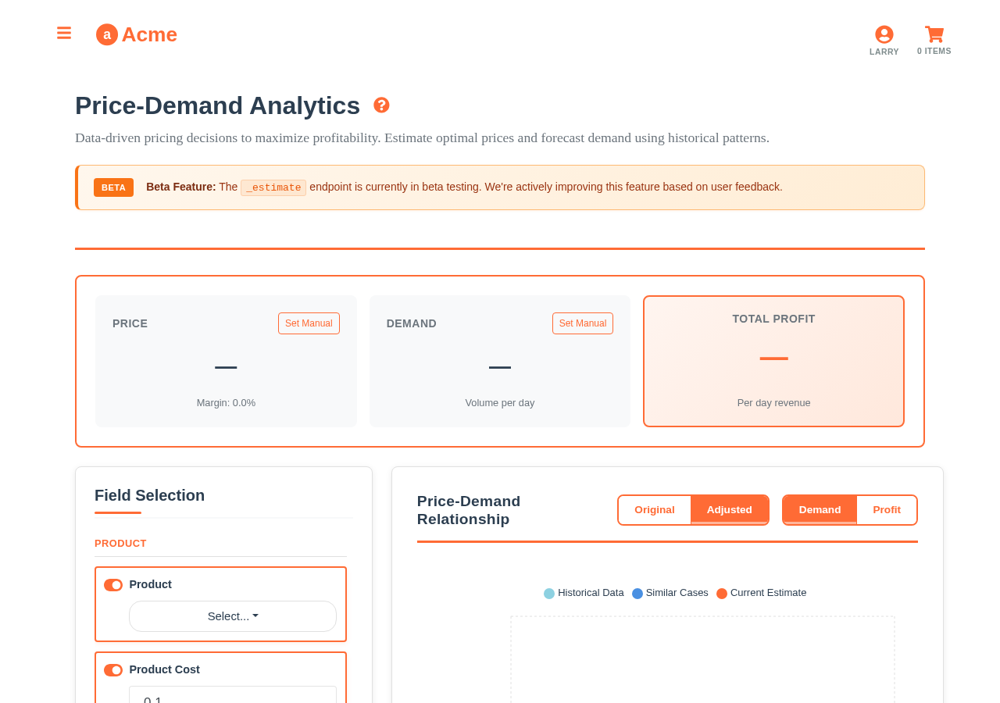
```json
{
  "from": "price_history",
  "where": {
    "product_id": "milk_organic",
    "day_of_week": "Friday",
    "is_weekend": false
  },
  "estimate": "sale_price",
  "model": "regression",
  "select": ["estimate", "why"]
}
```
// Returns: optimal price with demand forecast and profit maximization
[→ Implementation](src/12-price-estimation.js) | [Use case guide](docs/use-cases/11-price-optimization.md) | [🚀 Live Demo](https://demo.aito.ai/pricing)

## 🚀 Quick Start

<details>
<summary>Click to expand installation instructions</summary>

```bash
# Clone and run locally
git clone https://github.com/AitoDotAI/aito-demo.git
cd aito-demo
npm install
cp .env.example .env  # Includes working demo credentials
npm start
```

The app opens at `http://localhost:3000`. No API key setup required - uses public demo instance.

For your own Aito instance:
```bash
# Edit .env with your credentials
REACT_APP_AITO_URL=https://your-instance.aito.app
REACT_APP_AITO_API_KEY=your-api-key
```

</details>

## 🎯 Technical Highlights

**Performance**: 90K impressions dataset, <100ms query latency, no cold starts
**Schema**: Proper Aito format with linked tables (users → visits → contexts → impressions → products)
**Real Data**: 134 users, 42 products, 90,087 interaction records
**Architecture**: React frontend + Aito.ai backend, fully responsive

## 📖 Deep Dive

- **[Blog Post](docs/blog-post.md)**: Complete technical walkthrough
- **[Use Case Guides](docs/use-cases/)**: Detailed implementation guides for each feature
- **[Assistant Integration](docs/tutorials/assistant-integration.md)**: How to build AI assistants with Aito
- **[Data Model](docs/data-model.md)**: Schema design and relationships

## 🤝 Why This Matters

Replace months of ML pipeline development with SQL-like queries. No feature engineering, no model training, no deployment complexity. Just queries that return predictions.

**Traditional ML**: Feature pipelines → Model training → Serving infrastructure → Maintenance
**Aito.ai**: Query → Prediction ✅

---

*Built in a weekend to solve a real client problem. The entire codebase is open source - MIT licensed.*