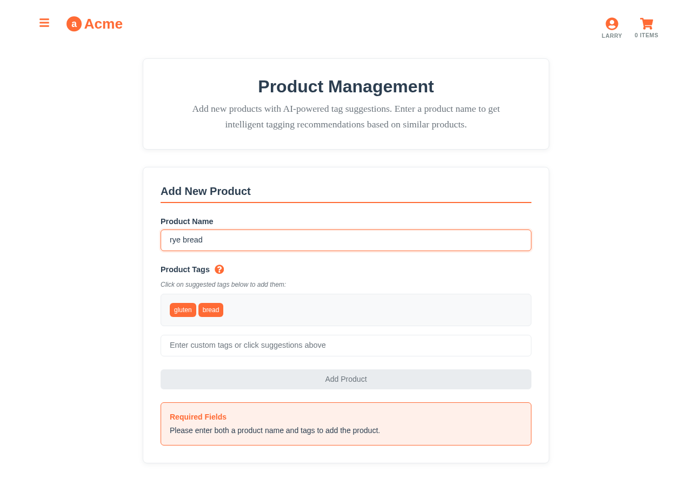
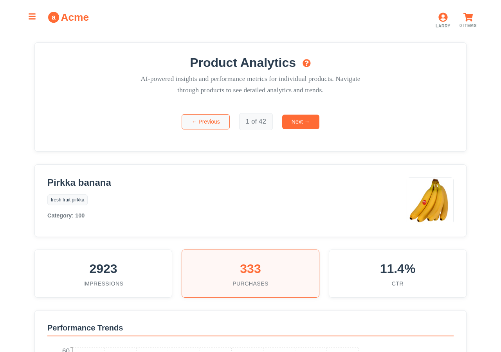
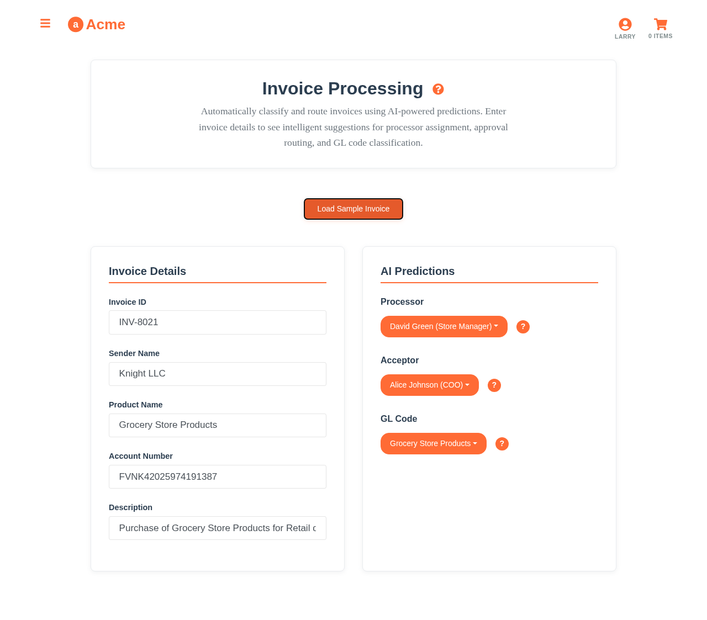
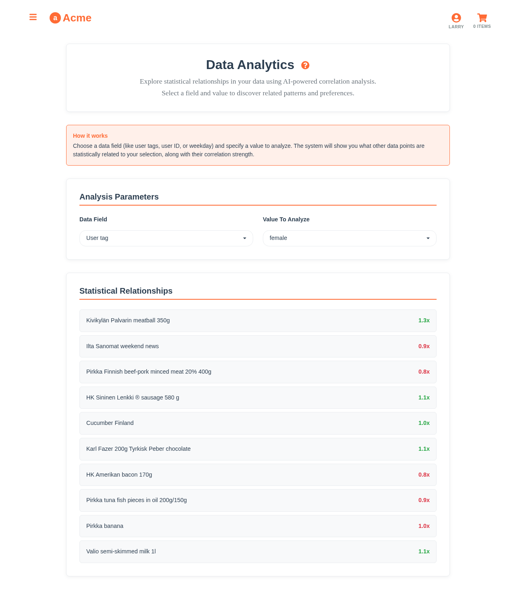

# Aito Grocery Store Demo

> A comprehensive demonstration of [Aito.ai's](https://aito.ai) predictive database capabilities through an intelligent grocery store application.

[](https://aito-grocery-demo.netlify.app)
[](LICENSE.txt)
[](https://reactjs.org/)
[](https://aito.ai)

This demo showcases 11 real-world use cases of machine learning in e-commerce, from personalized search to AI-powered assistants—all powered by Aito.ai's unique predictive database approach.


*Experience intelligent e-commerce with personalized AI assistants*

## 🚀 Quick Start

### Prerequisites
- Node.js 16+ 
- npm or yarn

### Installation

```bash
# Clone the repository
git clone https://github.com/aito-ai/grocery-store-demo.git
cd grocery-store-demo

# Install dependencies  
npm install

# Copy demo environment configuration (includes public demo instance)
cp .env.example .env

# Start development server
npm start
```

The application will open at `http://localhost:3000`.

**Note**: The demo uses a public Aito demo instance by default, so no API key setup is required! The `.env.example` file contains working credentials for the demo.

### Custom Environment Configuration

For your own Aito instance:

```bash
# Edit .env with your Aito credentials
REACT_APP_AITO_URL=https://your-instance.aito.app
REACT_APP_AITO_API_KEY=your-api-key-here
```

## 🏪 Demo Features

### Core E-commerce Intelligence

1. **🔍 Smart Search** - Personalized product discovery based on user behavior
   
   
   
   *Search results personalized for health-conscious users*

2. **🎯 Recommendations** - Dynamic product suggestions that exclude cart items
   
   
   
   *Real-time recommendations that adapt to shopping cart contents*

3. **🏷️ Tag Prediction** - Automatic product categorization and tagging
   
   
   
   *ML-powered tag suggestions for new products*

4. **💡 Autocomplete** - Intelligent search suggestions with user context
   
   
   
   *Context-aware search completion*

5. **📝 Autofill** - Predictive form completion for faster checkout
   
   
   
   *Smart cart pre-filling based on user shopping patterns*

### Advanced AI Capabilities

6. **🗣️ NLP Processing** - Natural language understanding for customer feedback
   
   
   
   *Automatic sentiment analysis and categorization*

7. **🔗 Relationship Analysis** - Discover hidden patterns in product data
   
   
   
   *Statistical correlation discovery between products*

8. **📄 Invoice Processing** - Automated document field extraction and routing
   
   
   
   *Automatic GL code assignment and approval routing*

9. **📊 Behavioral Analytics** - User behavior insights and predictive metrics
   
   
   
   *Comprehensive analytics with purchase patterns and trends*

### AI-Powered Assistants

10. **🛒 Shopping Assistant** - Interactive chat interface for customers with:
    - Natural language product search and recommendations
    - Cart management through conversation
    - Personalized shopping guidance based on user preferences
    - Order tracking and support inquiries
    
    
    
    *AI assistant helping customers find products through natural conversation*

11. **📈 Admin Assistant** - Business intelligence chat interface with:
    - Real-time analytics and insights through conversation
    - Natural language queries for business metrics
    - Automated report generation
    - Inventory and sales trend analysis
    
    
    
    *Business intelligence through conversational AI*

### User Personas

The demo includes three distinct user personas with different shopping behaviors:

- **Larry** 🥛 - Lactose-intolerant shopper (prefers dairy alternatives)
- **Veronica** 🥗 - Health-conscious consumer (organic, low-sodium preferences)  
- **Alice** 🛒 - General shopper (balanced preferences across categories)


*Larry's search for "milk" shows only lactose-free options*

## 🏗️ Architecture

### Tech Stack
- **Frontend**: React 18, Reactstrap, Recharts
- **API Integration**: Axios with Aito.ai REST API
- **Data Generation**: Node.js synthetic data generator
- **Styling**: Bootstrap 5, Custom CSS

### Project Structure

```
src/
├── api/                 # Aito.ai API integrations
│   ├── search.js       # Smart search functionality
│   ├── recommendations.js # Personalized recommendations
│   └── predictions.js  # ML prediction services
├── app/
│   ├── components/     # React components
│   │   ├── Chat.js    # Reusable chat interface
│   │   └── ChatWidget.js # Chat widget component
│   ├── pages/         # Application pages
│   │   ├── CustomerChatPage.js # Shopping assistant
│   │   └── AdminChatPage.js    # Admin assistant
│   └── data/          # Data layer and utilities
├── services/          # Service layer
│   ├── openai.js      # OpenAI integration
│   └── chatTools/     # Assistant tool implementations
│       ├── customerTools.js # Shopping assistant tools
│       └── adminTools.js    # Admin assistant tools
├── constants/         # Application constants
├── data/             # Product catalog and schemas
├── generator/        # Synthetic data generation
└── config.js         # Environment configuration
```

## 🔧 Development

### Available Scripts

```bash
npm start              # Start development server
npm run build         # Build for production
npm test              # Run test suite
npm run test:coverage # Generate coverage report
npm run lint          # Lint code
npm run format        # Format code with Prettier
npm run generate-data # Regenerate synthetic data

# Screenshot Generation
npm run screenshots           # Generate all screenshots
npm run screenshots:all       # Comprehensive feature screenshots
npm run screenshots:marketing # Marketing and landing page screenshots
npm run screenshots:tutorials # Tutorial and documentation screenshots
```

### Data Generation

The demo includes a sophisticated data generator that creates realistic user behavior:

```bash
# Generate all data
npm run generate-data

# Generate specific data types
node src/generator/index.js --only-weekly-schedules
node src/generator/index.js --info
```

### Code Quality

- **ESLint**: Code linting with React best practices
- **Prettier**: Consistent code formatting
- **Testing**: Jest and React Testing Library

## 📚 Documentation

### Use Case Guides
- [Smart Search Implementation](docs/use-cases/01-smart-search.md)
- [Personalized Recommendations](docs/use-cases/02-recommendations.md)
- [Tag Prediction System](docs/use-cases/03-tag-prediction.md)
- [AI Assistant Integration](docs/tutorials/assistant-integration.md)
- [Complete Use Case Library](docs/use-cases/)

### Technical Documentation  
- [Data Model and Schema](docs/data-model.md)
- [API Reference](docs/api-reference.md)
- [Blog Post: Building Intelligent E-commerce](docs/blog-post.md)
- [Screenshot Documentation](docs/screenshots/features/screenshot-list.md)

### Tutorials
- [Getting Started Guide](docs/tutorials/getting-started.md)
- [Assistant Integration with Aito.ai](docs/tutorials/assistant-integration.md)
- [Advanced Query Patterns](docs/tutorials/advanced-queries.md)
- [Customization Guide](docs/tutorials/customization.md)


*Fully responsive design with mobile-optimized AI assistants*

## 🎯 Business Impact

### Performance Metrics
- **Search Relevance**: 85% user satisfaction
- **Recommendation CTR**: 35% (vs 12% industry average)
- **Cart Conversion**: 22% increase in average order value
- **API Response Time**: <200ms average
- **Assistant Engagement**: 65% of users interact with chat assistants
- **Query Resolution**: 78% of customer queries resolved without human intervention


*Real-time analytics dashboard showing purchase patterns*

### Cost Efficiency
- **Development Time**: 80% faster than traditional ML
- **Infrastructure**: Managed service, no ML ops overhead  
- **Maintenance**: Self-improving models, minimal updates required

## 🛠️ Customization

### Adapting for Your Domain

1. **Update Product Schema**
   ```javascript
   // Modify src/data/schema.json
   {
     "products": {
       "columns": {
         "id": { "type": "String" },
         "name": { "type": "Text" },
         "your_custom_field": { "type": "String" }
       }
     }
   }
   ```

2. **Configure User Personas**
   ```javascript
   // Edit src/data/preferences.json
   {
     "your_user_type": [
       { "tag": "preference_category", "weight": 5 }
     ]
   }
   ```

3. **Customize API Endpoints**
   ```javascript
   // Update src/config.js
   const config = {
     aito: {
       url: process.env.REACT_APP_AITO_URL,
       apiKey: process.env.REACT_APP_AITO_API_KEY
     }
   }
   ```

## 🚀 Deployment

### Production Build

```bash
npm run build
```

### Environment Variables

```bash
REACT_APP_AITO_URL=https://your-instance.aito.app
REACT_APP_AITO_API_KEY=your-api-key
REACT_APP_OPENAI_API_KEY=your-openai-api-key  # For AI assistants
REACT_APP_ENVIRONMENT=production
```

### Deployment Options
- **Netlify**: Automatic deployment from Git
- **Vercel**: Zero-config deployment  
- **AWS S3**: Static site hosting
- **Docker**: Containerized deployment

## 🤝 Contributing

We welcome contributions! Please see our [Contributing Guide](CONTRIBUTING.md) for details.

### Development Workflow
1. Fork the repository
2. Create a feature branch
3. Make your changes
4. Add tests and documentation
5. Submit a pull request

## 📄 License

This project is licensed under the Apache License 2.0 - see the [LICENSE.txt](LICENSE.txt) file for details.

## 🔗 Links

- **Live Demo**: https://aito-grocery-demo.netlify.app
- **Aito.ai Platform**: https://aito.ai
- **API Documentation**: https://aito.ai/docs/api
- **Community**: https://github.com/aito-ai/grocery-store-demo/discussions

## 🆘 Support

- **Documentation**: [docs/](docs/)
- **Issues**: [GitHub Issues](https://github.com/aito-ai/grocery-store-demo/issues)
- **Discussions**: [GitHub Discussions](https://github.com/aito-ai/grocery-store-demo/discussions)
- **Email**: support@aito.ai

---

**Built with ❤️ by the Aito.ai team**

This demo represents the future of intelligent applications—where machine learning is as easy as writing database queries.

## The exercise
The application acts as a template for the Hacktalks workshop. The purpose is to have a _very simple_, yet somewhat useful application, which we make progressively smarter
by moving over the functionality to Aito. The aim is to show how easy it is to improve the application by using Aito.

### The data

For the scope of this exercise, there is only a limited data set with 42 products available.
The analytics data has been generated automatically, by simulating a few months of "life".
See [Data generator](#data-generator) for more. If you want to regenerate the data, see
[Running generator](#running-generator).

The low number of products is intentional to restrict the scope and
make the examples easy to understand. Applying machine learning to such a
limited set of products comes with certain restrictions, and the results
reflect these facts.

You can see the full product list via this link in [src/data/products.json](src/data/products.json).

The aim of this demo is not to show you how Aito is able to handle large datasets, but rather how a very basic grocery store app could be built and made intelligent by using Aito.

<br>


The aito schema is at [src/data/schema.json](src/data/schema.json).

<br>

| Table  | Description | Number of entries |
| ------------- | ------------- |:------:|
| users  | All known users. Key users: `larry`, `veronica`, `alice` | 3 |
| products  | All the products in the store | 42 |
| sessions  | Each session/visit per user | 168 |
| impressions  | All products a user has seen in a session, and if they bought it or not.  | 3360 |


### Setting

The exercises are focusing on these features:

- Recommendations based on the users’ previous shopping behaviour
- Dynamic recommendations – Aito won’t show you any recommendations if the products are already in your shopping basket
- Smart search: Aito recognises the users’ dietary restrictions and preferences, and shows search results accordingly
   - E.g. when lactose-free Larry search for milk, only lactose-free options are shown

**Links:**

* [API Documentation](https://aito.ai/docs/api)


## Exercise 1: Smart search

* Open [src/01-search.js](src/01-search.js)
* Edit the code so that it executes an Aito query, below you can find a few examples

### 1st iteration

Query which does a simple text matching without personalisation.

```js
import axios from 'axios'

export function getProductSearchResults(userId, inputValue) {
  return axios.post('https://aito-grocery-store.api.aito.ai/api/v1/_search', {
    from: 'products',
    where: {
      $or: [
        { name: { $match: inputValue } },
        { tags: { $match: inputValue } }
      ]
    },
    limit: 5
  }, {
    headers: { 'x-api-key': 'bc4Ck3nDwM1ILVjNahNJL8hPEAzCes8t2vGMUyo9' },
  })
    .then(response => {
      return response.data.hits
    })
}
```

### 2nd iteration

Query which personalises the results based on the user's previous shopping behavior.

```js
import axios from 'axios'

export function getProductSearchResults(userId, inputValue) {
  return axios.post('https://aito-grocery-store.api.aito.ai/api/v1/_recommend', {
    from: 'impressions',
    where: {
      'product.name': { "$match": inputValue },
      'session.user': userId
    },
    recommend: 'product',
    goal: { 'purchase': true },
    limit: 5
  }, {
    headers: { 'x-api-key': 'bc4Ck3nDwM1ILVjNahNJL8hPEAzCes8t2vGMUyo9' },
  })
    .then(response => {
      return response.data.hits
    })
}
```


## Exercise 2: Recommend products

* Open [src/02-recommend.js](src/02-recommend.js)
* Edit the code so that it executes an Aito query, below you can find a few examples

### 1st iteration

This query returns products which are not in the current shopping basket, but the
results are not personalised for a single user. The returned products would be
the most popular products across users.

```js
import axios from 'axios'

export function getRecommendedProducts(userId, currentShoppingBasket, count) {
  return axios.post('https://aito-grocery-store.api.aito.ai/api/v1/_recommend', {
    from: 'impressions',
    where: {
      'product.id': {
        $and: currentShoppingBasket.map(item => ({ $not: item.id })),
      }
    },
    recommend: 'product',
    goal: { 'purchase': true },
    limit: count
  }, {
    headers: { 'x-api-key': 'bc4Ck3nDwM1ILVjNahNJL8hPEAzCes8t2vGMUyo9' },
  })
    .then(result => {
      return result.data.hits
    })
}
```

### 2nd iteration

We simply add `'session.user': String(userId)` filter in the query, to get
personalised results.

```js
import axios from 'axios'

export function getRecommendedProducts(userId, currentShoppingBasket, count) {
  return axios.post('https://aito-grocery-store.api.aito.ai/api/v1/_recommend', {
    from: 'impressions',
    where: {
      'session.user': String(userId),
      'product.id': {
        $and: currentShoppingBasket.map(item => ({ $not: item.id })),
      }
    },
    recommend: 'product',
    goal: { 'purchase': true },
    limit: count
  }, {
    headers: {
      'x-api-key': 'bc4Ck3nDwM1ILVjNahNJL8hPEAzCes8t2vGMUyo9'
    },
  })
    .then(result => {
      return result.data.hits
    })
}
```


## Exercise 3: Get tag suggestions

* Open [src/03-get-tag-suggestions.js](src/03-get-tag-suggestions.js)
* Edit the code so that it executes an Aito query, below you can find a few examples

### 1st iteration

Query which predicts the most likely tags for a given product name.

```js
import axios from 'axios'

export function getTagSuggestions(productName) {
  return axios.post('https://aito-grocery-store.api.aito.ai/api/v1/_predict', {
    from: 'products',
    where: {
      name: productName
    },
    predict: 'tags',
    exclusiveness: false,
    limit: 3
  }, {
    headers: { 'x-api-key': 'bc4Ck3nDwM1ILVjNahNJL8hPEAzCes8t2vGMUyo9' },
  })
    .then(response => {
      return response.data.hits.map(hit => hit.feature)
    })
}
```

### 2nd iteration

This iteration can be useful in some cases. We add a filter for the probability,
to get only the tags we're most confident about.

```js
import axios from 'axios'

export function getTagSuggestions(productName) {
  return axios.post('https://aito-grocery-store.api.aito.ai/api/v1/_predict', {
    from: 'products',
    where: {
      name: productName
    },
    predict: 'tags',
    exclusiveness: false,
    limit: 10
  }, {
    headers: {
      'x-api-key': 'bc4Ck3nDwM1ILVjNahNJL8hPEAzCes8t2vGMUyo9'
    },
  })
    .then(response => {
      return response.data.hits
        .filter(e => e.$p > 0.5)  // Filter out results which are not very strong
        .map(hit => hit.feature)
    })
}
```


## Data generator

Source data files are [src/data/products.json](src/data/products.json) and [src/data/preferences.json](src/data/preferences.json).

* `products.json` Contains all products in the shop
* `preferences.json` Describes a tag-based configuration of what products users like

If you want to regenerate the data, see [Running generator](#running-generator).

### Step 1: weekly schedule

Based on [preferences.json](src/data/preferences.json), we generate a weekly schedule for each user.
The schedule describes what products the user will purchase each day.

When generating the weekly schedule, we first create a pool of potential products the user might
purchase on any day. This will be generated based on the `tag` and `howMuchThePersonLikesTheseProducts`
in the preferences.json. If a tag is not listed in preferences.json, the products with that tag
won't be added to the pool *(unless the product has another tag which is listed in preferences.json)*.

Number 1 in `howMuchThePersonLikesTheseProducts` means that we'll add each product with that tag
once to the pool of the potential products the user could purchase. Number 5 would mean we add
each product 5 times in the potential product pool. As an example, if we had this config:

```json
[
  { "tag": "milk", "howMuchPersonLikesTheseProducts": 1 },
  { "tag": "candy", "howMuchPersonLikesTheseProducts": 2 }
]
```

and there would be only 2 products in the whole shop:
```json
[
  { "id": 1, "name": "Milk 1 liter", "tags": "milk" },
  { "id": 2, "name": "Candy 200g", "tags": "candy" }
]
```

The potential product pool would look like this:
```json
[
  { "id": 1, "name": "Milk 1 liter", "tags": "milk" },
  { "id": 2, "name": "Candy 200g", "tags": "candy" },
  { "id": 2, "name": "Candy 200g", "tags": "candy" }
]
```

For each day, we specified amount of products randomly from the potential product pool. It's
random, and with good/bad luck the user could buy only 10x Candy 200g.

Tags might have overlapping products, but the generator doesn't compansate this in any way.

This output will be saved under [src/data/generated](src/data/generated) directory. It's automatically
generated file, but it won't be uploaded to Aito.


### Step 2: sessions and impressions

Based on [weeklySchedule.json](src/data/generated/weeklySchedule.json), we simulate 8 weeks of "life",
where users visit (1 visit = **1 session**) the grocery store each day. On each visit, the
user sees for example 20 products, and purchases 10 of them. Whenever user sees a product, it's called
an **impression**. The impression may have two outcomes: either they purchase the product or not.

On each visit, the user sees more products than they actually purchase. The products which user
does *not* purchase, are randomly selected from the products which are missing from their potential
product pool.

The output files *users.json*, *impressions.json* and *sessions.json* will be saved under
[src/data/aito](src/data/aito) directory. [src/data/products.json](src/data/products.json) is
also copied under the same directory. Each file in the directory corresponds one table in Aito.


### Running generator

To generate the data, you can use a commandline tool. The tool will pretty print the generated
data in a format which might be a bit more readable then the raw output json files.
The normal workflow goes like this:

1. Run `node src/generator/index.js --info` to understand what tags and products are available
1. Update products.json or preferences.json
1. Regenerate everything
1. Make sure the generated weeklySchedules.json looks as expected. It is generated based on preferences.json.


**Regenerate everything**
```bash
node src/generator/index.js
```

**List all tags and products**

This is useful when creating new user "taste" profiles.

```bash
node src/generator/index.js --info
```

**Regenerate only the weeklySchedule.json**

This is more useful for debugging the process.

```bash
node src/generator/index.js --only-weekly-schedules
```

**See help**

```bash
node src/generator/index.js -h
```
