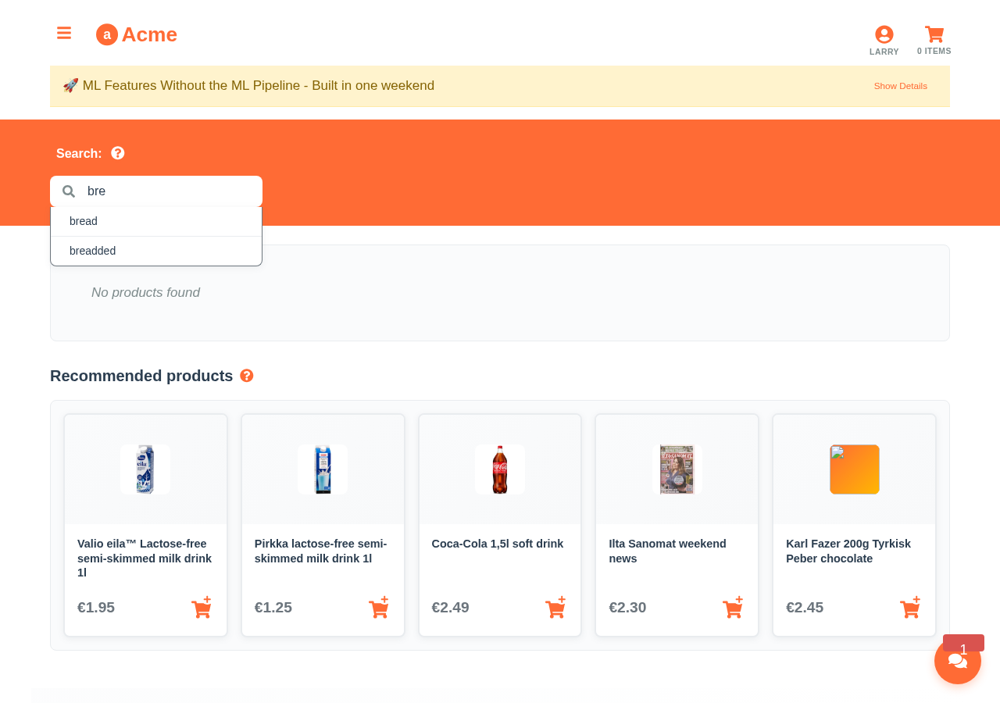

# Aito Grocery Store Demo

Aito.ai is a predictive database, that provides real time predictions, recommendations and statistics via instant SQL-like queries without separate train step. The goal of the system is to drastically reduce the effort needed to create basic machine learning applications.

The Aito.ai demo highlights 11 production-ready ML features that can be build extremely quickly using the predictive database capabilities. Each live feature comes with screenshots, code samples and tutorials. 

[](https://aito-grocery-demo.netlify.app) [](LICENSE.txt) [](https://aito.ai)

## Try It Now

```bash
# Test the API instantly (no signup required)
curl -X POST https://aito-demo.aito.app/api/v1/_predict \
  -H "X-API-Key: bvss2i2dIkaWUfBCdzEO89LpPNhqjD" \
  -H "Content-Type: application/json" \
  -d '{
    "from": "products",
    "where": {"name": {"$match": "milk"}},
    "predict": "tags"
  }'
```

## What I Built

### 1. 🔍 Smart Search with Personalization

```javascript
// Personalized search combining text similarity + purchase probability
{
  from: 'impressions',
  where: {
    product: {
      $or: [
        { tags: { $match: 'milk' } },
        { name: { $match: 'milk' } }
      ]
    },
    'context.user': 'larry'
  },
  get: 'product',
  orderBy: {
    $multiply: [
      '$similarity',                                  // Text relevance
      { $p: { $context: { purchase: true } } }       // Purchase likelihood
    ]
  },
  select: ['name', 'id', 'tags', 'price', '$matches'],
  limit: 5
}
```
[→ Implementation](src/01-search.js) | [Use case guide](docs/use-cases/01-smart-search.md)

### 2. 🎯 Dynamic Recommendations

```javascript
// Goal-oriented recommendations that exclude cart items
{
  recommend: 'product',
  goal: { purchase: true },
  where: {
    'product.id': { $and: cartItems.map(item => ({ $not: item.id })) }
  }
}
```
[→ Implementation](src/02-recommend.js) | [Use case guide](docs/use-cases/02-recommendations.md)

### 3. 🏷️ Automated Tag Prediction

```javascript
// Auto-generate product tags with confidence scores
{
  from: 'products',
  where: { name: 'Organic Dark Chocolate 70%' },
  predict: 'tags',
  limit: 10
}
// Returns: ['organic', 'chocolate', 'dark', 'healthy', 'premium']
```
[→ Implementation](src/03-get-tag-suggestions.js) | [Use case guide](docs/use-cases/03-tag-prediction.md)

### 4. 💡 Intelligent Autocomplete

```javascript
// Context-aware search suggestions
{
  from: 'contexts',
  where: { user: userId },
  get: 'queryPhrase',
  where: { queryPhrase: { $startsWith: inputText } }
}
```
[→ Implementation](src/04-autocomplete.js) | [Use case guide](docs/use-cases/04-autocomplete.md)

### 5. 📝 Smart Cart Autofill

```javascript
// Predict likely purchases based on user behavior
{
  from: 'impressions',
  where: { 'context.user': userId },
  recommend: 'product',
  goal: { purchase: true }
}
```
[→ Implementation](src/05-autofill.js) | [Use case guide](docs/use-cases/05-autofill.md)

### 6. 🗣️ NLP Text Classification

```javascript
// Classify customer feedback sentiment and category
{
  from: 'prompts',
  where: { prompt: 'The checkout process was confusing' },
  predict: ['sentiment', 'category', 'urgency']
}
// Returns: sentiment: 'negative', category: 'user_experience'
```
[→ Implementation](src/06-prompt.js) | [Use case guide](docs/use-cases/06-nlp-processing.md)

### 7. 📊 Statistical Relationship Discovery

```javascript
// Find correlations between user demographics and purchases
{
  from: 'visits',
  where: { 'user.tags': 'club-member' },
  relate: 'purchases'
}
// Returns: lift scores showing what club members buy more
```
[→ Implementation](src/07-relate.js) | [Use case guide](docs/use-cases/07-data-analytics.md)

### 8. 📄 Automated Invoice Processing

```javascript
// Predict GL codes and approvers with explanations
{
  from: 'invoices',
  where: { vendor: 'Tech Solutions Inc', amount: 2500 },
  predict: ['GLCode', 'Processor', 'Approver'],
  select: ['$p', { $why: { highlight: true } }]
}
```
[→ Implementation](src/08-predict-invoice.js) | [Use case guide](docs/use-cases/08-invoice-processing.md)

### 9. 📈 Product Analytics Dashboard

```javascript
// Comprehensive product analysis in one batch request
{
  from: 'impressions',
  where: { 'product.id': productId },
  get: 'context.week',
  select: ['$value', '$f', { $sum: { $context: 'purchase' } }]
}
```
[→ Implementation](src/09-product.js) | [Use case guide](docs/use-cases/09-product-analytics.md)

### 10. 🤖 AI Shopping Assistant

```javascript
// Natural language interface powered by Aito queries
// "Find gluten-free bread under $5"
{
  from: 'impressions',
  where: {
    'product.tags': { $match: 'gluten-free bread' },
    'product.price': { $lte: 5 }
  },
  orderBy: { $p: { $context: { purchase: true } } }
}
```
[→ Implementation](src/services/chatTools/customerTools.js) | [Use case guide](docs/tutorials/assistant-integration.md)

### 11. 🔧 Admin Business Intelligence

```javascript
// Conversational business analytics
// "What are our top selling products this week?"
{
  from: 'impressions',
  where: { purchase: true, 'context.week': currentWeek },
  get: { $group: 'product.name', $stats: { sales: { $count: true } } },
  orderBy: { sales: -1 }
}
```
[→ Implementation](src/services/chatTools/adminTools.js) | [Use case guide](docs/tutorials/assistant-integration.md)

## 🚀 Quick Start

<details>
<summary>Click to expand installation instructions</summary>

```bash
# Clone and run locally
git clone https://github.com/AitoDotAI/aito-demo.git
cd aito-demo
npm install
cp .env.example .env  # Includes working demo credentials
npm start
```

The app opens at `http://localhost:3000`. No API key setup required - uses public demo instance.

For your own Aito instance:
```bash
# Edit .env with your credentials
REACT_APP_AITO_URL=https://your-instance.aito.app
REACT_APP_AITO_API_KEY=your-api-key
```

</details>

## 🎯 Technical Highlights

**Performance**: 90K impressions dataset, <100ms query latency, no cold starts
**Schema**: Proper Aito format with linked tables (users → visits → contexts → impressions → products)
**Real Data**: 134 users, 42 products, 90,087 interaction records
**Architecture**: React frontend + Aito.ai backend, fully responsive

## 📖 Deep Dive

- **[Blog Post](docs/blog-post.md)**: Complete technical walkthrough
- **[Use Case Guides](docs/use-cases/)**: Detailed implementation guides for each feature
- **[Assistant Integration](docs/tutorials/assistant-integration.md)**: How to build AI assistants with Aito
- **[Data Model](docs/data-model.md)**: Schema design and relationships

## 🤝 Why This Matters

Replace months of ML pipeline development with SQL-like queries. No feature engineering, no model training, no deployment complexity. Just queries that return predictions.

**Traditional ML**: Feature pipelines → Model training → Serving infrastructure → Maintenance
**Aito.ai**: Query → Prediction ✅

---

*Built in a weekend to solve a real client problem. The entire codebase is open source - MIT licensed.*