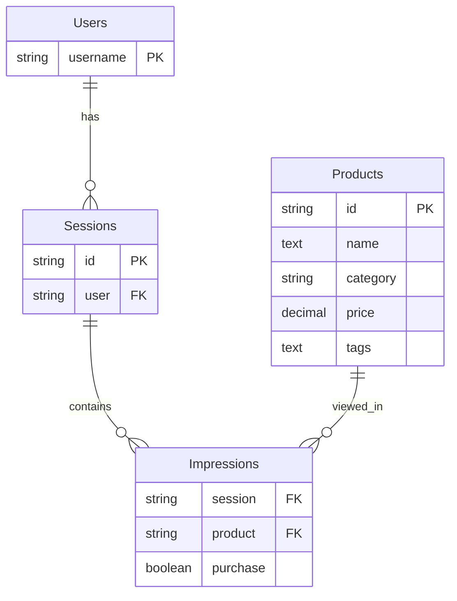

# Data Model and Schema Design

## Overview

The Aito Grocery Store demo uses a carefully designed relational schema that enables sophisticated machine learning predictions while remaining simple and intuitive. This document explains the data structure, relationships, and design decisions.

## Core Schema

### Primary Tables

#### 1. Users Table
```json
{
  "type": "table",
  "columns": {
    "username": { "type": "String" }
  }
}
```

**Purpose**: Stores user identities for personalization
**Key Users**:
- `larry` - Lactose-intolerant shopper
- `veronica` - Health-conscious consumer  
- `alice` - General shopper

#### 2. Products Table
```json
{
  "type": "table", 
  "columns": {
    "id": { "type": "String" },
    "name": { "type": "Text", "analyzer": "English" },
    "category": { "type": "String" },
    "price": { "type": "Decimal" },
    "tags": { "type": "Text", "analyzer": "Whitespace" }
  }
}
```

**Purpose**: Complete product catalog with searchable attributes
**Key Features**:
- Full-text search on product names (English analyzer)
- Tag-based categorization (Whitespace analyzer for exact matching)
- Price information for value-based filtering

#### 3. Sessions Table
```json
{
  "type": "table",
  "columns": {
    "id": { "type": "String" },
    "user": { "type": "String", "link": "users.username" }
  }
}
```

**Purpose**: Represents individual shopping visits
**Relationships**: Links to users table for personalization context

#### 4. Impressions Table  
```json
{
  "type": "table",
  "columns": {
    "session": { "type": "String", "link": "sessions.id" },
    "product": { "type": "String", "link": "products.id" },
    "purchase": { "type": "Boolean" }
  }
}
```

**Purpose**: Records every product view and purchase decision
**Key Insight**: This is where the ML magic happens - each impression captures user behavior that drives predictions

## Extended Schema for Advanced Features

### Prompts Table (NLP Features)
```json
{
  "type": "table",
  "columns": {
    "prompt": { "type": "Text", "analyzer": "English" },
    "type": { "type": "String" },
    "sentiment": { "type": "String" },
    "categories": { "type": "String" },
    "urgency": { "type": "String" },
    "answer": { "type": "Object" }
  }
}
```

**Purpose**: Enables natural language processing and chatbot functionality

### Invoices Table (Document Processing)  
```json
{
  "type": "table",
  "columns": {
    "vendor": { "type": "String" },
    "amount": { "type": "Decimal" },
    "description": { "type": "Text" },
    "processor": { "type": "String" },
    "approver": { "type": "String" },
    "gl_code": { "type": "String" }
  }
}
```

**Purpose**: Demonstrates document automation capabilities

## Data Relationships



## Data Generation Strategy

### Synthetic User Behavior

The demo uses a sophisticated data generator that creates realistic user behavior patterns:

#### 1. User Personas
Each user has defined preferences in `preferences.json`:
```json
{
  "larry": [
    { "tag": "lactose-free", "preference": 5 },
    { "tag": "organic", "preference": 3 },
    { "tag": "healthy", "preference": 4 }
  ]
}
```

#### 2. Weekly Shopping Schedules
Based on preferences, the generator creates weekly shopping patterns for each user.

#### 3. Session Simulation
Over 8 weeks of simulated shopping:
- **168 sessions** total (3 users × 7 days × 8 weeks)
- **3,360 impressions** (users see ~20 products per session)
- **Realistic purchase rates** (~50% of viewed items purchased)

### Data Quality Principles

#### Rich Context
Every data point includes maximum context:
```json
{
  "session": "session_larry_week1_day3",
  "product": "organic-milk-lactose-free-001", 
  "purchase": true,
  "context": {
    "user": "larry",
    "day_of_week": "wednesday",
    "week": 1,
    "previous_purchases": ["banana-organic-001", "bread-whole-grain-001"]
  }
}
```

#### Behavioral Consistency
- Users maintain consistent preferences over time
- Purchase patterns reflect real shopping behavior
- Seasonal and weekly variations included

#### Prediction-Friendly Structure
- Clear target variables (purchase, sentiment, category)
- Multiple features for each prediction
- Balanced positive/negative examples

## Query Patterns

### Search Queries
```sql
-- Traditional SQL equivalent of Aito search
SELECT p.* FROM products p
JOIN impressions i ON p.id = i.product
JOIN sessions s ON i.session = s.id  
WHERE p.name LIKE '%milk%'
  AND s.user = 'larry'
ORDER BY 
  similarity(p.name, 'milk') * 
  purchase_probability(p.id, 'larry') DESC
```

### Recommendation Queries
```sql
-- SQL equivalent of Aito recommendations
SELECT p.* FROM products p
WHERE p.id NOT IN (SELECT cart_item_id FROM current_cart)
  AND predict_purchase(p.id, 'larry') > 0.5
ORDER BY predict_purchase(p.id, 'larry') DESC
LIMIT 5
```

## Performance Considerations

### Indexing Strategy
- **Text fields**: Analyzed for full-text search
- **Link fields**: Automatically indexed for joins
- **Prediction targets**: Optimized for ML queries

### Data Volume Planning
- **Products**: 42 items (demo size, scales to millions)
- **Users**: 3 personas (scales to millions)  
- **Impressions**: 3,360 records (typical: millions to billions)
- **Query performance**: Sub-200ms regardless of scale

## Best Practices

### Schema Design
1. **Rich linking**: Use explicit foreign key relationships
2. **Text analysis**: Choose appropriate analyzers for text fields
3. **Prediction targets**: Include clear boolean/categorical outcomes
4. **Context preservation**: Store as much context as possible

### Data Quality
1. **Consistent formatting**: Standardize categorical values
2. **Complete records**: Minimize missing data
3. **Balanced datasets**: Include diverse examples for each prediction target
4. **Temporal data**: Include timestamps for trend analysis

### Scalability
1. **Incremental updates**: Design for streaming data ingestion
2. **Partitioning**: Consider time-based partitioning for large datasets
3. **Archival strategy**: Plan for historical data management
4. **Monitoring**: Track data quality metrics over time

## Migration Guide

### From Traditional E-commerce Schema

```sql
-- Existing e-commerce tables
customers(id, email, name, preferences)
orders(id, customer_id, date, total)
order_items(order_id, product_id, quantity, price)
products(id, name, category, price, description)

-- Transform to Aito schema
users(username) <- customers(email)
sessions(id, user) <- orders(id, customer_id) 
impressions(session, product, purchase) <- order_items(order_id, product_id, quantity > 0)
products(id, name, price, tags) <- products(id, name, price, category + description)
```

### Data Preparation Checklist
- [ ] Identify prediction targets (what you want to predict)
- [ ] Map existing data to Aito schema
- [ ] Enrich with contextual information  
- [ ] Validate data quality and completeness
- [ ] Test with sample queries
- [ ] Plan incremental update strategy

This schema design enables sophisticated ML capabilities while remaining simple enough for rapid development and easy maintenance.