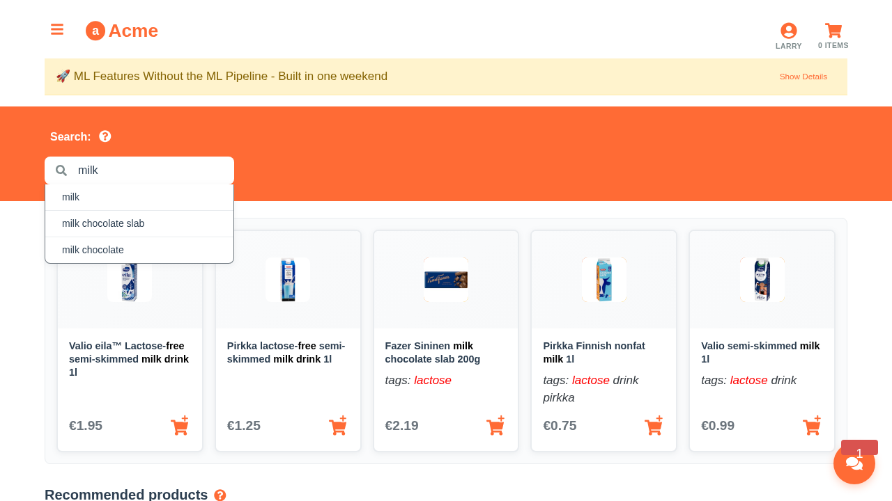

# Screenshots Directory

This directory contains automated screenshots for the Aito Grocery Store Demo application.

## Directory Structure

```
screenshots/
├── marketing/          # High-quality images for marketing materials
│   ├── landing-page-*  # Landing page variations
│   ├── app-interface-* # App interface showcases
│   └── mobile-*        # Mobile responsive views
├── tutorials/          # Step-by-step tutorial screenshots
│   ├── search-*        # Search feature demonstrations
│   ├── recommendations-* # Recommendation system
│   ├── invoice-*       # Invoice processing workflow
│   └── chat-*          # Chat interface examples
├── documentation/      # Technical documentation images
│   ├── api-*          # API interaction examples
│   ├── architecture-* # System architecture diagrams
│   └── features-*     # Feature-specific screenshots
└── general/           # General purpose screenshots
    └── misc-*         # Miscellaneous captures
```

## Screenshot Types

### Marketing Materials
- **High Resolution**: 1920x1080 for presentations and marketing
- **Landing Page**: Full page captures showcasing the application
- **Mobile Views**: Responsive design demonstrations
- **Hero Sections**: Focused captures of key interface areas

### Tutorial Documentation
- **Step-by-Step**: Sequential screenshots for user guides
- **Feature Demonstrations**: Individual feature showcases
- **User Personas**: Screenshots showing personalization for different users
- **Workflow Examples**: Complete user journey captures

### Technical Documentation
- **API Examples**: Screenshots of API responses and data flows
- **Architecture Views**: System component visualizations
- **Error States**: Error handling and edge case examples
- **Development Tools**: Screenshots of development interfaces

## Automated Generation

Screenshots are automatically generated using Playwright. Use these commands:

```bash
# Generate all screenshots
npm run screenshots

# Generate specific categories
npm run screenshots:marketing
npm run screenshots:tutorials
npm run screenshots:docs

# Generate for specific features
npm run screenshots -- searchFeatures recommendations

# Run Playwright tests with screenshot generation
npm run test:screenshots
```

## Manual Screenshots

For one-off screenshots or specific scenarios:

```bash
# Using the screenshot generator script
node scripts/screenshot-generator.js landingPage
node scripts/screenshot-generator.js --help

# Using Playwright directly
npx playwright test tests/screenshots.spec.js
```

## Best Practices

1. **Consistent Viewport**: Use standard viewport sizes (1280x720 for desktop, 375x667 for mobile)
2. **Wait for Loading**: Always wait for network idle and animations to complete
3. **User Context**: Include personalized views with different user personas
4. **File Naming**: Use descriptive names with feature and context (e.g., `search-results-milk-larry.png`)
5. **Quality**: Use PNG format for crisp images, full-page captures when appropriate

## File Naming Conventions

- **Feature-based**: `{feature}-{action}-{context}.png`
  - `search-results-milk-larry.png`
  - `recommendations-homepage-veronica.png`
- **Page-based**: `{page}-{section}-{viewport}.png`
  - `landing-page-hero-desktop.png`
  - `invoice-processing-list-mobile.png`
- **Marketing**: `{purpose}-{resolution}.png`
  - `app-interface-hires.png`
  - `landing-page-mobile.png`

## Integration with Documentation

Screenshots are referenced in:
- Tutorial markdown files (`docs/tutorials/`)
- README files
- Blog posts (`docs/blog-post.md`)
- Architecture documentation

Use relative paths when referencing:
```markdown

```

## Maintenance

- Screenshots are regenerated automatically in CI/CD when UI changes
- Manual updates may be needed for new features or design changes
- Review screenshot quality periodically for consistency
- Update this README when adding new screenshot categories

## Troubleshooting

### Common Issues
1. **Blank Screenshots**: Ensure the development server is running (`npm start`)
2. **Timing Issues**: Increase wait times in the generator script
3. **Missing Elements**: Check that UI elements exist and are visible
4. **Permission Errors**: Ensure write permissions for the screenshots directory

### Dependencies
- Playwright browsers must be installed (`npx playwright install`)
- Development server must be running on port 3000
- Sufficient disk space for image files

---

*Last updated: Generated automatically with Aito Grocery Store Demo*