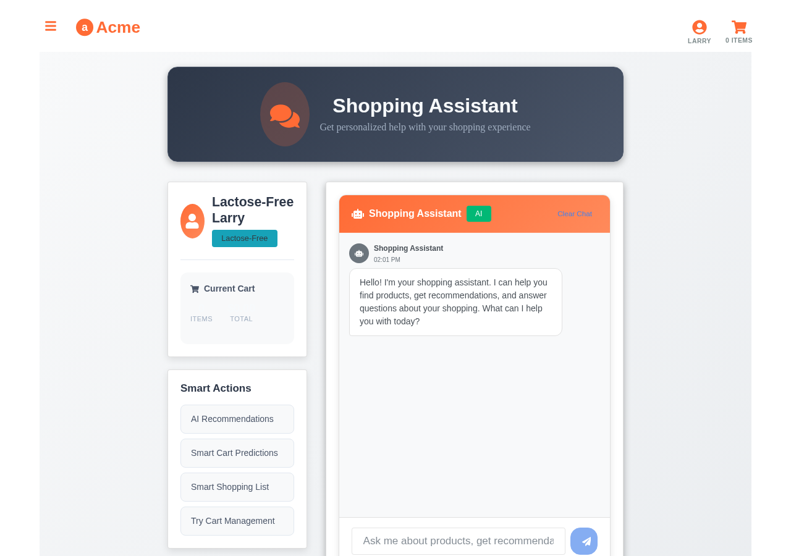

# AI Assistant Integration with Aito.ai



*Shopping Assistant providing personalized help and product recommendations*


*Admin Assistant delivering business intelligence and analytics through conversation*

This tutorial demonstrates how the Aito Grocery Store Demo integrates AI-powered assistants with Aito.ai's predictive database to create intelligent, context-aware conversational interfaces.

## Overview

The demo includes two specialized AI assistants that leverage Aito.ai's capabilities:

1. **Shopping Assistant** - Helps customers find products, manage their cart, and get personalized recommendations
2. **Admin Assistant** - Provides business insights, analytics, and operational intelligence

Both assistants use OpenAI's GPT models for natural language understanding while Aito.ai powers all data queries, predictions, and personalization.

## Architecture

### System Flow

```
User Input → OpenAI GPT → Tool Selection → Aito.ai Query → Response Processing → User Output
```

### Key Components

1. **Chat Interface** (`src/app/components/Chat.js`)
   - Reusable chat component with streaming support
   - Tool execution handling
   - Message history management

2. **Assistant Pages**
   - `CustomerChatPage.js` - Shopping assistant interface
   - `AdminChatPage.js` - Admin analytics interface

3. **Tool Implementations**
   - `customerTools.js` - Shopping-specific Aito.ai integrations
   - `adminTools.js` - Analytics and admin Aito.ai queries

## Shopping Assistant Integration

### Available Tools

The shopping assistant has access to these Aito.ai-powered tools:

```javascript
const CUSTOMER_TOOLS = [
  {
    name: "search_products",
    description: "Search for products with personalized results",
    parameters: {
      query: "Search term",
      userId: "Current user ID"
    }
  },
  {
    name: "get_recommendations",
    description: "Get personalized product recommendations",
    parameters: {
      userId: "User ID",
      excludeCartItems: "Array of product IDs to exclude"
    }
  },
  {
    name: "add_to_cart",
    description: "Add a product to the shopping cart",
    parameters: {
      productId: "Product ID",
      productName: "Alternative: product name"
    }
  }
];
```

### Example Implementation: Personalized Search

```javascript
async function searchProducts(query, userId) {
  const response = await axios.post(
    `${AITO_URL}/api/v1/_query`,
    {
      from: 'impressions',
      where: {
        product: {
          $or: [
            { name: { $match: query } },
            { tags: { $match: query } }
          ]
        },
        'context.user': userId
      },
      get: 'product',
      orderBy: {
        $multiply: [
          '$similarity',
          { $p: { $context: { purchase: true } } }
        ]
      },
      limit: 5
    },
    { headers: { 'x-api-key': AITO_API_KEY } }
  );
  
  return response.data.hits;
}
```

### Personalization Flow

1. **User Context** - Assistant identifies the current user (Larry, Veronica, Alice)
2. **Query Enhancement** - Aito.ai adds user preferences to search queries
3. **Ranking** - Results are ordered by purchase probability for that specific user
4. **Dynamic Updates** - Cart exclusions are applied in real-time

## Admin Assistant Integration

### Analytics Tools

The admin assistant provides conversational access to business metrics:

```javascript
const ADMIN_TOOLS = [
  {
    name: "get_sales_analytics",
    description: "Retrieve sales metrics and trends",
    parameters: {
      timeframe: "daily, weekly, monthly",
      metric: "revenue, volume, growth"
    }
  },
  {
    name: "analyze_user_behavior",
    description: "Analyze customer shopping patterns",
    parameters: {
      segmentation: "demographics, preferences, frequency"
    }
  },
  {
    name: "get_product_performance",
    description: "Get product performance metrics",
    parameters: {
      productId: "Optional specific product",
      metric: "sales, impressions, conversion"
    }
  }
];
```

### Complex Analytics Example

```javascript
async function getProductPerformance(productId) {
  // Get purchase analytics
  const purchaseStats = await axios.post(
    `${AITO_URL}/api/v1/_query`,
    {
      from: 'impressions',
      where: productId ? { 'product.id': productId } : {},
      get: { 
        $aggr: {
          $group: 'product.name',
          $stats: {
            purchases: { $sum: { $if: 'purchase' } },
            impressions: { $count: true },
            conversionRate: { 
              $avg: { $cast: { $if: 'purchase', 1, 0 } } 
            }
          }
        }
      },
      orderBy: { purchases: -1 },
      limit: 10
    }
  );

  // Get temporal patterns
  const temporalPatterns = await axios.post(
    `${AITO_URL}/api/v1/_relate`,
    {
      from: 'impressions',
      where: { purchase: true },
      relate: ['context.weekday', 'product.category'],
      limit: 20
    }
  );

  return {
    statistics: purchaseStats.data.hits,
    patterns: temporalPatterns.data.hits
  };
}
```

## Integration Best Practices

### 1. Context Preservation

Always maintain user context throughout the conversation:

```javascript
const executeToolFunction = async (toolName, parameters) => {
  // Inject current user context
  const enrichedParams = {
    ...parameters,
    userId: this.props.state.selectedUserId,
    currentCart: this.props.state.shoppingCart
  };
  
  return await executeCustomerTool(toolName, enrichedParams);
};
```

### 2. Error Handling

Provide graceful fallbacks for Aito.ai queries:

```javascript
try {
  const results = await searchProducts(query, userId);
  if (!results || results.length === 0) {
    // Fallback to non-personalized search
    return await searchProductsGeneric(query);
  }
  return results;
} catch (error) {
  console.error('Aito.ai query failed:', error);
  return {
    success: false,
    message: "I'm having trouble searching right now. Please try again."
  };
}
```

### 3. Response Formatting

Format Aito.ai responses for conversational UI:

```javascript
function formatProductResponse(products) {
  if (!products.length) {
    return "I couldn't find any products matching your search.";
  }
  
  return `I found ${products.length} products for you:\n\n` +
    products.map((p, i) => 
      `${i + 1}. **${p.name}** - $${p.price}\n` +
      `   ${p.tags || 'No tags'}\n` +
      `   Match score: ${(p.$p * 100).toFixed(0)}%`
    ).join('\n');
}
```

### 4. Streaming Responses

Implement streaming for better UX:

```javascript
const streamResponse = async (prompt, onToken) => {
  const stream = await openai.chat.completions.create({
    model: 'gpt-4',
    messages: [{ role: 'user', content: prompt }],
    stream: true,
    tools: CUSTOMER_TOOLS
  });

  for await (const chunk of stream) {
    if (chunk.choices[0]?.delta?.content) {
      onToken(chunk.choices[0].delta.content);
    }
  }
};
```

## Advanced Features

### 1. Multi-Query Optimization

Batch related Aito.ai queries for efficiency:

```javascript
const batchQueries = await axios.post(
  `${AITO_URL}/api/v1/_batch`,
  {
    queries: [
      { 
        endpoint: '_query',
        payload: searchQuery 
      },
      { 
        endpoint: '_recommend',
        payload: recommendQuery 
      },
      { 
        endpoint: '_predict',
        payload: predictQuery 
      }
    ]
  }
);
```

### 2. Contextual Explanations

Use Aito.ai's `$why` operator to explain recommendations:

```javascript
const explainRecommendation = await axios.post(
  `${AITO_URL}/api/v1/_recommend`,
  {
    from: 'impressions',
    where: { 'context.user': userId },
    recommend: 'product',
    goal: { purchase: true },
    select: ['*', '$why'],
    limit: 1
  }
);

// Format explanation for user
const why = explainRecommendation.data.hits[0].$why;
return `I recommend this because users like you who bought ${why.positiveExamples[0]} also purchased this item.`;
```

### 3. Adaptive Personalization

Dynamically adjust personalization strength:

```javascript
const getPersonalizedResults = async (query, userId, personalizationLevel = 0.7) => {
  const baseScore = { $similarity: query };
  const userScore = { $p: { $context: { purchase: true } } };
  
  return await aitoQuery({
    orderBy: {
      $add: [
        { $multiply: [baseScore, 1 - personalizationLevel] },
        { $multiply: [userScore, personalizationLevel] }
      ]
    }
  });
};
```

## Testing Assistant Integration

### Unit Testing Example

```javascript
describe('Shopping Assistant Tools', () => {
  it('should return personalized search results', async () => {
    const results = await searchProducts('milk', 'larry');
    
    // Larry is lactose intolerant, should see dairy-free options first
    expect(results[0].tags).toContain('lactose-free');
    expect(results[0].$p).toBeGreaterThan(0.7);
  });

  it('should exclude cart items from recommendations', async () => {
    const cartItems = ['milk-001', 'bread-002'];
    const recommendations = await getRecommendations('alice', cartItems);
    
    const recommendedIds = recommendations.map(r => r.id);
    expect(recommendedIds).not.toContain('milk-001');
    expect(recommendedIds).not.toContain('bread-002');
  });
});
```

## Deployment Considerations

### Environment Setup

```bash
# Required environment variables
REACT_APP_AITO_URL=https://your-instance.aito.app
REACT_APP_AITO_API_KEY=your-aito-api-key
REACT_APP_OPENAI_API_KEY=your-openai-key

# Optional configuration
REACT_APP_ASSISTANT_MODEL=gpt-4-turbo-preview
REACT_APP_MAX_TOKENS=2000
REACT_APP_TEMPERATURE=0.7
```

### Security Best Practices

1. **API Key Management** - Never expose Aito.ai keys in client code
2. **Query Validation** - Validate all user inputs before Aito.ai queries
3. **Rate Limiting** - Implement rate limits for assistant requests
4. **Content Filtering** - Filter inappropriate content in both directions

## Next Steps

1. **Extend Tools** - Add more Aito.ai integrations (invoice processing, analytics)
2. **Multi-language** - Use Aito.ai's language-agnostic text matching
3. **Voice Integration** - Add speech-to-text for voice shopping
4. **Proactive Assistance** - Use Aito.ai predictions to suggest actions

## Resources

- [Aito.ai API Documentation](https://aito.ai/docs/api)
- [OpenAI Function Calling](https://platform.openai.com/docs/guides/function-calling)
- [Demo Source Code](https://github.com/AitoDotAI/aito-demo)

---

*This tutorial demonstrates the power of combining Aito.ai's predictive database with modern AI assistants to create truly intelligent, personalized user experiences.*