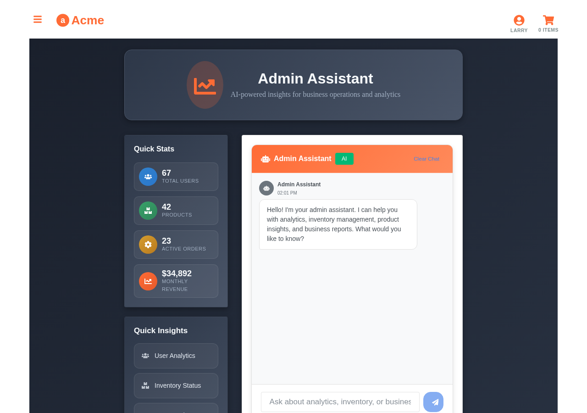
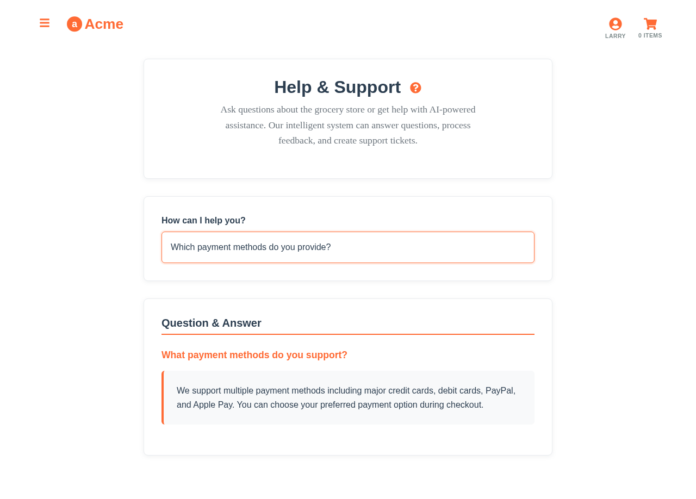

# Getting Started with the Aito Grocery Store Demo

## Quick Start Guide

This tutorial will get you up and running with the Aito Grocery Store demo in under 10 minutes. You'll learn how to set up the project, understand the core features, and start experimenting with Aito.ai's predictive database capabilities.

## Prerequisites

Before you begin, ensure you have:

- **Node.js 16+** installed ([Download here](https://nodejs.org/))
- **Git** for cloning the repository
- A **modern web browser** (Chrome, Firefox, Safari, Edge)
- Basic familiarity with **JavaScript/React** (helpful but not required)

## Step 1: Clone and Setup

### 1.1 Clone the Repository

```bash
git clone https://github.com/aito-ai/grocery-store-demo.git
cd grocery-store-demo
```

### 1.2 Install Dependencies

```bash
npm install
```

This will install all required packages including React, Axios, and development tools.

### 1.3 Start the Development Server

```bash
npm start
```

The application will automatically open at `http://localhost:3000`.

## Step 2: Explore the Demo

### 2.1 User Personas

The demo includes three distinct user personas, each with different shopping behaviors:

- **Larry** 🥛 - Lactose-intolerant shopper
- **Veronica** 🥗 - Health-conscious consumer  
- **Alice** 🛒 - General shopper


**Try this**: Switch between users using the dropdown in the top navigation and observe how search results and recommendations change.

### 2.2 Smart Search

Navigate to the main page and try searching:

1. **Search for "milk" as Larry**: Notice how lactose-free options appear first
2. **Search for "milk" as Veronica**: See organic and low-fat options prioritized
3. **Search for "snacks" as different users**: Observe personalized results


### 2.3 Personalized Recommendations

1. Add some products to your cart
2. Notice how recommendations update automatically
3. Items already in your cart are never recommended
4. Switch users and see how recommendations change


### 2.4 AI Shopping Assistant

**New Feature**: Try the shopping assistant:

1. Navigate to the **Customer Chat** page
2. Ask natural language questions like:
   - "I need gluten-free bread options"
   - "What organic vegetables do you have?"
   - "Add milk to my cart"
3. Watch the AI assistant search products and manage your cart through conversation


## Step 3: Understand the Technology

### 3.1 API Architecture

The demo uses Aito.ai's predictive database through simple HTTP APIs:

```javascript
// Example: Smart Search
const searchResults = await axios.post('https://aito-instance.aito.app/api/v1/_query', {
  from: 'impressions',
  where: {
    'product.name': { $match: searchTerm },
    'context.user': userId
  },
  get: 'product',
  orderBy: {
    $multiply: ['$similarity', { $p: { $context: { purchase: true } } }]
  }
})
```

### 3.2 Key Concepts

**Predictive Queries**: Instead of training separate ML models, you query predictions like database records.

**Behavioral Data**: The system learns from user interactions (views, purchases) stored in the `impressions` table.

**Context-Aware**: Every prediction considers user context, current cart, and behavior patterns.

## Step 4: Explore Advanced Features

### 4.1 Admin Assistant

**New Feature**: Try the AI-powered admin assistant:

1. Navigate to **Admin Chat** page
2. Ask business intelligence questions like:
   - "What are our top selling products this week?"
   - "Show me customer behavior trends"
   - "Analyze product performance by category"
3. Get instant insights through natural conversation



### 4.2 Analytics Dashboard

Visit `/analytics` to see:

- User behavior insights
- Product performance metrics
- Prediction confidence scores
- Interactive charts and heatmaps


### 4.3 Invoice Processing

Explore document automation:

1. Go to **Invoice Processing** page
2. See ML-powered field extraction
3. Watch automatic GL code assignment
4. Observe approval workflow routing


### 4.4 Natural Language Processing

Try the prompt interface:

1. Go to the help page
2. Enter customer feedback: "The checkout process was confusing"
3. See automatic sentiment analysis and categorization



## Step 5: Customize and Experiment

### 5.1 Modify User Preferences

Edit `src/data/preferences.json` to change user personas:

```json
{
  "larry": [
    { "tag": "lactose-free", "howMuchPersonLikesTheseProducts": 5 },
    { "tag": "plant-based", "howMuchPersonLikesTheseProducts": 4 },
    { "tag": "organic", "howMuchPersonLikesTheseProducts": 3 }
  ]
}
```

### 5.2 Regenerate Data

After modifying preferences:

```bash
npm run generate-data
```

This creates new synthetic user behavior based on your preferences.

### 5.3 Add New Products

Edit `src/data/products.json`:

```json
{
  "id": "my-product-001",
  "name": "My Custom Product",
  "category": "Custom",
  "price": 9.99,
  "tags": "custom special unique"
}
```

## Step 6: Development Workflow

### 6.1 Available Scripts

```bash
npm start              # Development server
npm run build         # Production build
npm test              # Run test suite
npm run lint          # Check code quality
npm run format        # Format code
npm run generate-data # Regenerate synthetic data

# Screenshot Generation
npm run screenshots:all       # Generate all feature screenshots
npm run screenshots:marketing # Marketing screenshots
npm run screenshots:tutorials # Tutorial screenshots
```

### 6.2 Project Structure

```
src/
├── api/                # Aito.ai API integrations
│   ├── search.js      # Smart search functionality
│   ├── recommendations.js # Personalized recommendations
│   └── predictions.js # ML prediction services
├── app/
│   ├── components/    # React components
│   │   ├── Chat.js   # Reusable chat interface
│   │   └── ChatWidget.js # Chat widget component
│   ├── pages/        # Application pages
│   │   ├── CustomerChatPage.js # Shopping assistant
│   │   └── AdminChatPage.js    # Admin assistant
│   └── data/         # Data layer
├── services/         # Service layer
│   ├── openai.js     # OpenAI integration
│   └── chatTools/    # Assistant tool implementations
├── constants/        # Application constants
├── data/            # Product catalog and schemas
└── config.js        # Environment configuration
```

### 6.3 Key Files to Understand

- **`src/config.js`**: API configuration and environment setup
- **`src/api/`**: All Aito.ai integrations
- **`src/data/schema.json`**: Database schema definition
- **`src/app/App.js`**: Main application logic

## Step 7: Connect Your Own Aito Instance

### 7.1 Create Environment File

```bash
cp .env.example .env
```

### 7.2 Configure Your Instance

Edit `.env`:

```bash
REACT_APP_AITO_URL=https://your-instance.aito.app
REACT_APP_AITO_API_KEY=your-api-key
REACT_APP_OPENAI_API_KEY=your-openai-key  # For AI assistants
REACT_APP_ENVIRONMENT=development
```

### 7.3 Upload Data to Your Instance

Follow [Aito.ai documentation](https://aito.ai/docs) to:

1. Create a new Aito instance
2. Upload the schema from `src/data/schema.json`
3. Upload data files from `src/data/aito/`

## Common Issues and Solutions

### Issue: "Failed to fetch" errors

**Solution**: 
1. Check your API key and URL in `.env`
2. Verify your Aito instance is running
3. Check browser console for detailed errors

### Issue: Empty search results

**Solution**:
1. Ensure data is uploaded to your Aito instance
2. Check that schema matches the data structure
3. Verify API permissions

### Issue: Slow performance

**Solution**:
1. Check your internet connection
2. Verify Aito instance region (use closer region)
3. Enable browser caching for better UX

## Next Steps

Now that you have the demo running, explore these advanced topics:

1. **[Assistant Integration Tutorial](./assistant-integration.md)** - Learn how AI assistants work with Aito.ai
2. **[Advanced Query Patterns](./advanced-queries.md)** - Learn complex Aito queries
3. **[Customization Guide](./customization.md)** - Adapt the demo for your domain
4. **[Use Case Deep Dives](../use-cases/)** - Understand each feature in detail

## Need Help?

- **Documentation**: Browse the [complete documentation](../README.md)
- **Issues**: Report problems on [GitHub Issues](https://github.com/aito-ai/grocery-store-demo/issues)
- **Community**: Join discussions on [GitHub Discussions](https://github.com/aito-ai/grocery-store-demo/discussions)
- **Support**: Email support@aito.ai for technical assistance

## What's Next?

This demo is just the beginning. Aito.ai's predictive database can power:

- **E-commerce personalization** at any scale
- **Content recommendation** for media platforms
- **Document automation** for business processes
- **Customer intelligence** for CRM systems
- **And much more...**

The same query-based approach works across all these domains, making intelligent applications accessible to every developer.

Ready to build your own intelligent application? Start with this demo as your foundation and adapt it to your specific use case!