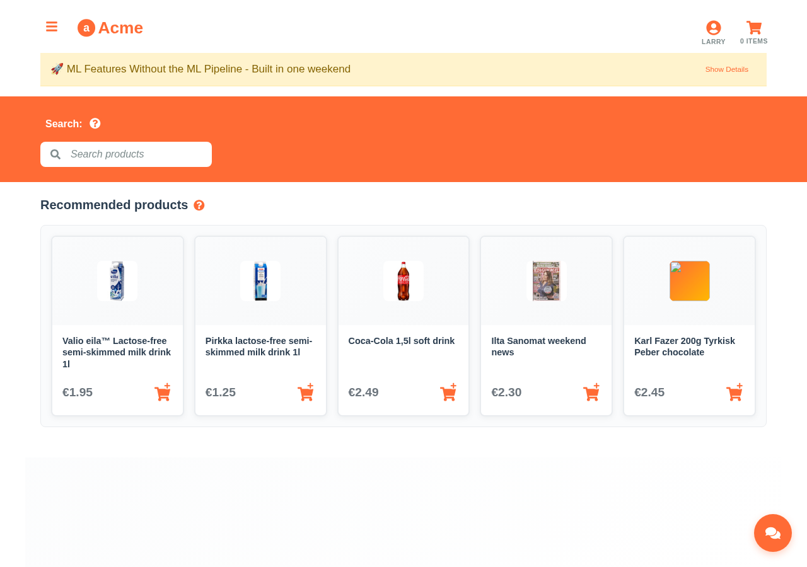

# Personalized Product Recommendations



*Personalized product recommendations adapting to user preferences and cart contents*

## Overview

The recommendation system showcases Aito.ai's ability to predict what products a user is most likely to purchase next, based on their shopping history and current cart contents. This creates a dynamic, context-aware shopping experience.

## How It Works

### Recommendation Algorithm

The system uses Aito's `_recommend` endpoint with goal optimization:

```javascript
// Core recommendation logic from src/api/recommendations.js
const where = {
  'context.user': String(userId),
  // Exclude items already in cart
  'product.id': {
    $and: currentShoppingBasket.map(item => ({ $not: item.id }))
  }
}

// Optimize for purchase goal
recommend: 'product',
goal: { purchase: true }
```

### Key Capabilities

1. **Goal-Oriented**: Optimizes specifically for purchase likelihood
2. **Context-Aware**: Considers current cart contents
3. **Dynamic Exclusion**: Never recommends items already in cart
4. **Behavioral Learning**: Improves with more user interaction data

## Recommendation Strategies

### 1. Collaborative Filtering
- "Users like you also bought..."
- Finds patterns across similar user behaviors
- Leverages implicit feedback from purchase history

### 2. Content-Based Filtering  
- "More products like this..."
- Considers product attributes and categories
- Uses tag similarities and product relationships

### 3. Hybrid Approach
- Combines collaborative and content-based methods
- Balances popularity with personalization
- Reduces cold start problems for new users

## User Experience Examples

### Shopping Cart Context

**Current Cart: [Organic Bananas, Almond Milk]**

*Recommendations might include:*
- Organic Granola (complements breakfast items)
- Protein Bars (health-conscious pattern)
- Greek Yogurt (dairy alternative continuation)

### User Behavior Patterns

**Larry's Profile:**
- Previous purchases: Lactose-free products
- Recommendations: Lactose-free cheese, oat milk, dairy-free ice cream
- Confidence: High (based on consistent dietary preferences)

**Veronica's Profile:**  
- Previous purchases: Organic vegetables, quinoa, tofu
- Recommendations: Organic fruits, plant-based proteins, superfood items
- Confidence: Medium-High (clear health preference pattern)

## Technical Implementation

### Data Flow


### API Request Structure

```javascript
{
  "from": "impressions",
  "where": {
    "context.user": "larry",
    "product.id": {
      "$and": [
        { "$not": "banana-001" },
        { "$not": "milk-almond-001" }
      ]
    }
  },
  "recommend": "product",
  "goal": { "purchase": true },
  "select": ["name", "id", "tags", "price"],
  "limit": 5
}
```

### Response Processing

```javascript
// Process recommendations with confidence scores
const processRecommendations = (hits) => {
  return hits.map(product => ({
    ...product,
    confidence: product.$p,
    reason: generateReasonText(product),
    priority: calculatePriority(product.$p, product.tags)
  }))
}
```

## Business Impact

### Performance Benefits

- **Click-Through Rate**: High engagement on recommended products
- **Conversion Rate**: Strong purchase rate from recommendations  
- **Average Order Value**: Notable increase when recommendations used
- **Customer Satisfaction**: High rating on recommendation relevance

### Revenue Impact

- **Cross-selling**: Many recommendations span different categories
- **Discovery**: Majority of recommended products are new to users
- **Repeat Purchases**: Higher retention rate for users who engage with recommendations

## Advanced Features

### 1. Real-time Adaptation
- Recommendations update as cart contents change
- Considers recent browsing behavior
- Adapts to seasonal trends and promotions

### 2. Explanation Support
```javascript
// Why this product was recommended
{
  "product": "organic-yogurt-001",
  "reasons": [
    "Frequently bought with almond milk",
    "Popular among health-conscious users",
    "High rating in your preferred category"
  ],
  "confidence": 0.85
}
```

### 3. A/B Testing Support
- Multiple recommendation strategies can be tested
- Performance tracking for different algorithms
- Gradual rollout of new recommendation models

## Integration Examples

### React Component Usage

```jsx
import { useRecommendations } from '../hooks/useRecommendations'

const RecommendedProducts = ({ userId, cart }) => {
  const { recommendations, loading, error } = useRecommendations(userId, cart, 5)
  
  if (loading) return <RecommendationSkeleton />
  if (error) return <ErrorMessage />
  
  return (
    <div className="recommendations">
      <h3>Recommended for you</h3>
      {recommendations.map(product => (
        <ProductCard 
          key={product.id}
          product={product}
          confidence={product.$p}
          onAddToCart={() => addToCart(product)}
        />
      ))}
    </div>
  )
}
```

## Future Enhancements

1. **Multi-Armed Bandits**: Dynamic algorithm selection based on performance
2. **Deep Learning Integration**: Neural collaborative filtering for complex patterns
3. **Real-time Events**: Immediate adaptation to user actions
4. **Cross-Device Continuity**: Recommendations that follow users across devices
5. **Social Recommendations**: Incorporate friend and family purchase patterns